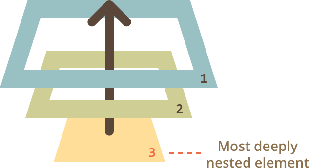

#### What is CRUD? Give a brief overview of how you can create a CRUD API

- Create.Read.Update.Delete. You can create a CRUD API utilizing JavaScript. There are certain verbs for CRUD such as POST, GET, PUT, DELETE. You can utilized technology like Express, Mongoose, etc to create these CRUD API.

#### Explain the same-origin policy and how it relates to CORS.

- Same-origin policy means that only files from the same origin can have access to each other, it is very important to remember that the same-origin policy applies only to scripts.
- Cross-Origin Resource Sharing (CORS) is a mechanism that uses additional HTTP headers to tell a browser to let a web application running at one origin (domain) have permission to access selected resources from a server at a different origin.

#### What is destructuring? Can you give me an example of destructuring an array and an object? How do I destructure a function parameters?

- Destructuring is a convenient way of extracting multiple values from data stored in (possibly nested) objects and Arrays.
- Array
  ```js
  const iterable = ['a', 'b'];
  const [x, y] = iterable;
  // x = 'a'; y = 'b'
  ```
- Object example
  ```js
  const person = {
    first: 'Wes',
    last: 'Bos',
    country: 'Canada',
    city: 'Hamilton',
    twitter: '@wesbos'
  };
  const first = person.first;
  const last = person.last;
  //Wes Bos Approved
  ```

#### What is an ES6 template literal? What problem do they solve? Can you give an example of a template literal in use?

- ES6 Template literals are string literals allowing embedded expressions.
- Example
  ```js
  const studentTemplate = templater`<article>
    <h3>${'name'} is a student at HackerYou</h3>
    <p>You can find their work at ${'blogUrl'}.</p>
  ```

</article>`
  ```

#### How do you calculate the "length" of an object (i.e. the number of keys)

- Answer

```js
var myArray = {
  name: 'time',
  age: 26,
  location: 'los angeles'
};

Object.size = function(obj) {
  var size = 0,
    key;
  for (key in obj) {
    if (obj.hasOwnProperty(key)) size++;
  }
  return size;
};

// Get the size of an object
var size = Object.size(myArray);

console.log(size);
//Result is 3
```

#### What will be the output of this code?

```js
for (var i = 0; i < 10; i++) {
  setTimeout(function() {
    console.log(i);
  }, 1000);
}
```

- 10, 10, 10, 10, 10, 10, 10, 10, 10, 10
  - (Console Logs 10, 10 times.)

**Follow-up:** How can we fix this to output `1, 2, 3, 4 ...`

- Answer

```js
for (var i = 1; i <= 10; i++) {
  console.log(i);
}
//Just remove the setTimeout lol
```

#### Write a function `duplicate` that takes an array and returns a new array containing each element twice.

Example:

```js
duplicate([1, 2, 3, 4]); // [1, 1, 2, 2, 3, 3, 4, 4]
```

- Answer:

```js
var arrayNum = [1, 2, 3, 4];
var newArray = [];

function duplicate(arrayVar) {
  arrayVar.forEach(arrayItem => {
    for (let i = 0; i < 2; i++) {
      newArray.push(arrayItem);
    }
  });
}

duplicate(arrayNum);

console.log(newArray);
```

**Bonus**: return an array where the amount of each element in the returned array is its index in the original

Example:

```js
duplicate([1, 2, 3, 4]); // [2, 3, 3, 4, 4, 4]
```

-Answer

```js
var arrayNum = [1, 2, 3, 4];
var newArray = [];

function duplicate(arrayVar) {
  arrayVar.forEach(arrayItem => {
    for (let i = 0; i < arrayVar.indexOf(arrayItem); i++) {
      newArray.push(arrayItem);
    }
  });
}

duplicate(arrayNum);

console.log(newArray);
```

#### Can you describe the main difference between a `.forEach` loop and a `.map` loop and why you would pick one versus the other?

- The `.forEach` method doesn’t return anything (undefined). It simply calls a provided function on each element in your array. This callback is allowed to mutate the calling array.
- The `.map()` method will also call a provided function on every element in the array. The difference is that map() utilizes return values and actually returns a new Array of the same size.
- Depending on the variable, array, or object you would utilize one over the other.

#### Explain event bubbling

- The process is called “bubbling”, because events “bubble” from the inner element up through parents like a bubble in the water.. When an event happens on an element, it first runs the handlers on it, then on its parent, then all the way up on other ancestors.


